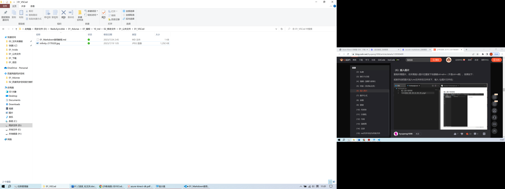

---
#文章封面
title: "This is the title: it contains a colon"
titleDelim: s
abstract: |
  This is the abstract.

  It consists of two paragraphs.
author:
- Author One
- Author Two
keywords:
- nothing
- nothingness

#添加章编号
chapters: true
linkReferences: true
nameInLink: true

#图编号
figureTitle: 图  #图标题名称
figPrefix: 图  #交叉引用名称
#titleDelim: s  #默认为冒号：:
figureTemplate: $$figureTitle$$$$i$$ $$t$$  #去除titleDelim
#figLabels: arabic #默认为阿拉伯数字
figPrefixTemplate: $$p$$$$i$$ #去除引用名字,default $$p$$&nbsp;$$i$$

#表编号
tableTitle: 表
tblPrefix: 表
tableTemplate: $$tableTitle$$$$i$$ $$t$$
tblPrefixTemplate: $$p$$$$i$$ #去除引用名字

#方程编号
autoEqnLabels: true #公式自动编号
tableEqns: true #使用表格形式对公式进行排版，转word效果更好
eqnBlockTemplate: |
   `<w:pPr><w:tabs><w:tab w:val="center" w:leader="none" w:pos="4325" /><w:tab w:val="right" w:leader="none" w:pos="8681" /></w:tabs></w:pPr><w:r><w:tab /></w:r>`{=openxml} $$t$$ `<w:r><w:tab /></w:r>`{=openxml} $$i$$
#1英寸相当于2.54厘米 1440 twips = one inch A4纸宽度21cm 信纸21.59
#居中pos的计算方式：(页面宽度/2-左边距)*1440/2.54 
#右边pos的计算方式：页面宽度-左边距-右边距
eqnBlockInlineMath: true
equationNumberTeX: \\tag
eqnIndexTemplate: ($$i$$) #这个是给编号加上括号
eqnPrefixTemplate: 式&nbsp;($$i$$) #给引用的公式编号加上括号
#我的word里是A4的，页边距为3.17cm，但是计算得到的数据是偏的
#所以结合手都调整，有两种参数：
#word自带公式的：4322     8637
#mathtype公式的：4325     8681

#参考文献
bibliography: [我的文库.bib]
link-citations: true
reference-section-title: "参考文献"
---

# md教程

## 资源

&emsp;&emsp;一个大创项目，做了一个`VSC`的插件，直接把markdown转化成网页博客发布。网址：[$limf(x)$](https://www.limfx.pro/)。

## 文本

&emsp;&emsp;Ctrl+Shift切换输入工具，

Shift或者Ctrl+Space切换中英文，

在中文模式下Ctrl+Space切换中英文标点符号。

<center>

居中

</center>

## 标题

&emsp;&emsp;标题设置方法为#加上空格加上文字，最多6级标题。#号后面空一格就行。

## 换行与分段

### 空格和缩进

&thinsp;一个细空字符实现，

&thinsp;二个细空字符实现；

&nbsp; 一个标准空字符实现，

&nbsp;&nbsp;二个标准空字符；

&ensp;一个半角空字符实现，

&ensp;&ensp;二个半角空字符；

&emsp;一个全角空字符实现，

&emsp;&emsp;二个全角空字符。

### 空格

&emsp;&emsp;单行内容， 键入几个空格都只会有一个   细空字符 产生；
键入一个回车，也会产生一个细空字符。

### 段内强制换行

&emsp;&emsp;换行的格式为，打至少键入两个空格，再键入一个回车。  
这是第二行，  
这是第三行。

&emsp;&emsp;不要用段内强制换行，在word格式里两端对齐，中间会有很大的空隙。

### 分段

&emsp;&emsp;分段的方法不是键入的一个回车，需要至少键入两个回车，才是分段。这是第一段。

&emsp;&emsp;这是第二段。

&emsp;&emsp;键入三个回车依旧是分段而不是空一行。


键入四个回车依旧是分段而不是空两行。


上面键入了键入四个回车。可以结合空格字符实现空行，如：

 &emsp;&emsp;
 
 &emsp;&emsp;
  
空了两行。word里不会换行，只会产生空格。

## 强调（加粗与斜体）

&emsp;&emsp;*斜体*

&emsp;&emsp;**加粗**

## 列表

### 有序列表

1. 输入1.加一个空格，按回车会自动补全编号
   1. 键入一个Tab会分级列表
2. 回车，后键入Backspace会回到上一级列表

### 无序列表

\* 输入输入星号"\*"加空格
+ 或者加号"+"加空格
- 或者减号"-"加空格
 - 键入一个Tab会分级列表
- 回车，后键入Backspace会回到上一级列表

目前word里对无序列表不支持。

## 插入图片

&emsp;&emsp;截图后剪切板里有图片，按下快捷键ctrl+alt+v。直接引用图，不加标题和标签。

{#fig:1}

或者手动把图片加入md文件所在文件夹下，输入代码：

``` markdown
 
```

{#fig:精美壁纸}

只有壁纸如上[@fig:精美壁纸]标题和标签都加了，才会正常显示并编号。

## 数学公式

&emsp;&emsp;支持LaTex语法，单独一行展示公式：

::: {custom-style="Figure"}
$$
f(x)=a \cdot x + b \\
f(x)=a \cdot x + b + c
$$
:::

下一个公式，如下[@eq:1]

::: {custom-style="Figure"}
$$
f(x)=a x+b
$$ {#eq:1}
:::

和文字一起的内嵌公式 $f(x)=a\cdot x+b$这样就可以了。之所以要加域`::: {custom-style="Figure"}`是因为pandoc的公式转word时候，样式为正文，正文设置固定行距时，公式会显示不全，公式的行距要求为单倍行距，所以单独设置样式。

## 表格

&emsp;&emsp;如下[@tbl:1]。

<!-- 让表格居中显示的风格 -->
<style>
.center 
{
  width: auto;
  display: table;
  margin-left: auto;
  margin-right: auto;
}
</style>

<p align="center"><font face="黑体" size=2.>表1 示例表格</font></p>

<div class="center">

| 左对齐 |  居中对齐 | 右对齐|
|:- | :-: | -:|
| 第一行题头和第二行之间加入表格符号 | Alt+Shift+f格式化文本编排 | |

  : Caption {#tbl:1}

</div>

<center>

| 左对齐 |  居中对齐 | 右对齐|
|:- | :-: | -:|
| 第一行题头和第二行之间加入表格符号 | Alt+Shift+f格式化文本编排 | |
| 第三行 | | |

  : Caption {#tbl:3}

</center>

如上[@tbl:3]，表格居中参考[这里](https://stackoverflow.com/q/24127507/22348569)

&emsp;&emsp;word设置表格样式，参考[三分钟快速制作论文三线表](https://www.bilibili.com/video/BV1ug411e7KH/?share_source=copy_web&vd_source=6b55cb6788b1952e04c06b095d772810)

## 链接

[文本内跳转](#标题)

> [文本外跳转（同目录下）](/xx.md#标题)
> [文本外跳转（从根目录开始）](./doc/xx.md#标题)

在VSC中，输入./后会自动联想文件，但是中文会变成乱码，如何解决？

指定文件夹[下载](file:\\C:/Users/Adunas/Desktop/)

网址跳转这个是[百度链接](https://www.baidu.com/)

## 代码块

&emsp;&emsp;代码开始

```
int a = 1;
int b = 0;
```

代码结束

&emsp;&emsp;C语言代码高亮、添加行号。

```c {.line-numbers}
int a = 1;
int b = 0;
```

```{.c .line-numbers}
int a = 1;
int b = 0;
```

## 分割线

&emsp;&emsp;如下，需要空一行。

---

___

***

如上

## 引用

> 这是引用

### 引用和有序列表

> 1. 第一行
>     1. 第二行，在这里对齐会正常显示
>         1. 第三行，在这里对齐会正常显示

## 流程图

&emsp;&emsp;对于flowchart先掌握这五个最基本的用法，后面参考Markdown Preview Enhanced进行学习。

``` flow
st=>start: 开始
e=>end: 结束
ipt=>inputoutput: 输入一个x
cond1=>condition: x是否大于0
tag1=>operation: 任务
st->ipt->cond1
cond1(yes)->tag1
cond1(no)->e
tag1->e
```


## 文献引用

&emsp;&emsp;硕士论文文献引用和本科毕业论文的要求不同。本科毕业论文要求以编号进行索引，而硕士论文是以作者、年份进行索引。正文中索引一般有两种格式：一种是这样[@sun2021]研究提到；第二种是这样：引用完一段文字后[@di2013]，以及多条目引用[@niu2015;@tran2021]。[@tschopp2020]

## 目录

[TOC]
