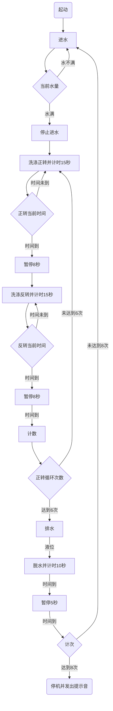

# 图表

## graphviz

&emsp;&emsp;参考：[markdown 绘图利器之graphviz](./html/markdown%20绘图利器之graphviz%20%20zhuanlan.zhihu.com%20p%20194274635.htm)。一个例子如下：

```graphviz
digraph structs {
    node[shape=record];
    graph[rankdir=LR];

    struct1[label="<f0> left|<f1> mid&#92; dle|<f2> right"];
    struct2[label="<f0> one|<f1> two"];
    struct3[label="hello&#92;nworld |{ b |{c|<here> d|e}| f}| g | h"];
    struct1:f1 -> struct2:f0;
    struct1:f2 -> struct3:here;
}
```



## mermaid

&emsp;&emsp;参考：[使用Typora画 流程图、时序图、顺序图、甘特图、等图详解](https://dandelioncloud.cn/article/details/1578950641525682178)。离线文档参考：[使用Typora画 流程图、时序图、顺序图、甘特图、等图详解.htm](./html/使用Typora画%20流程图、时序图、顺序图、甘特图、等图详解.htm)。一个例子如下：



## tikz是啥？

## DiagrammeR是啥？

```
grViz("digraph flowchart {
      # node definitions with substituted label text
      node [fontname = Helvetica, shape = rectangle]        
      tab1 [label = '@@1']
      tab2 [label = '@@2']
      tab3 [label = '@@3']
      tab4 [label = '@@4']
      tab5 [label = '@@5']
      tab6 [label = '@@6']
      tab7 [label = '@@7']
      tab8 [label = '@@8']
      # edge definitions with the node IDs
      tab1 -> tab2;
      tab2 -> tab3 -> tab6;
      tab2 -> tab4 -> tab5;
      tab6 -> tab7-> tab8;
      tab5 -> tab7;
      }
      [1]: 'Questionnaire sent to n=1000 participants'
      [2]: 'Participants came to clinic for evaluation n=700'
      [3]: 'Participants non-eligible for the study n=100'
      [4]: 'Participants eligible for the study n=600'
      [5]: 'Study sample n=600'
      [6]: 'sada non-eligible for the study n=100'
      [7]: 'Participants asda for the study n=600'
      [8]: 'Study sample n=as'
      ")
```
