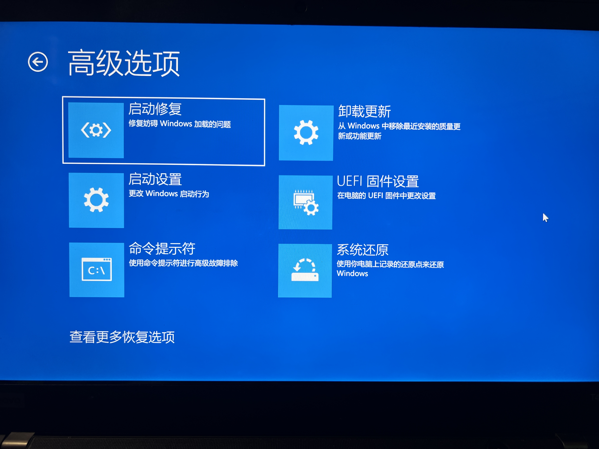
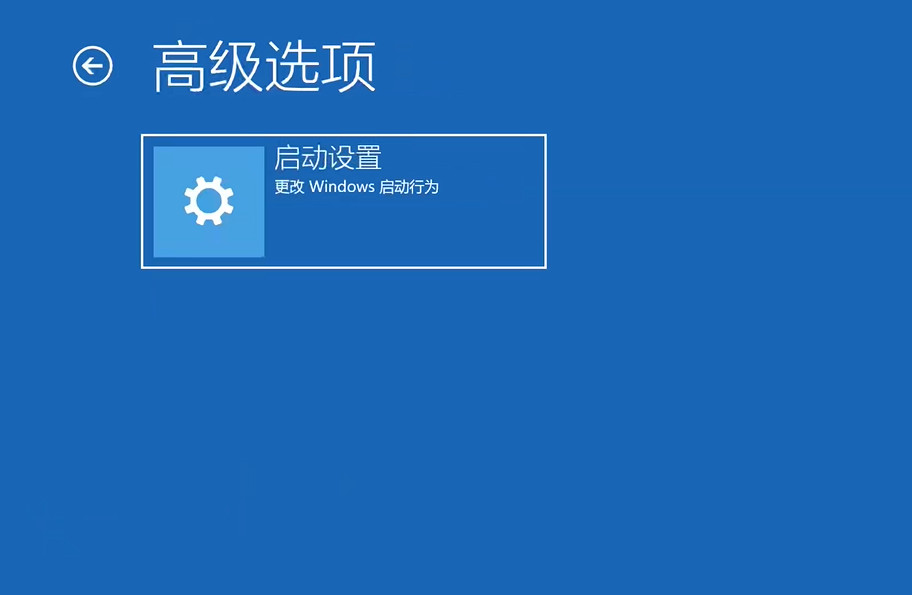

# disk

## 文件夹说明

1. [picture](./picture/)：图片。
2. ：。

## 恢复分区

&emsp;&emsp;恢复分区是Windows修复磁盘的分区，记录了之前的磁盘分配规则。删除后不会对电脑使用产生影响。但是失去记录后无法利用该功能进行修复。

&emsp;&emsp;当你点击shift+重启，会进入修复选项，疑难解答-高级选项。如下[@fig:正常的恢复选项]所示：

{@fig:正常的恢复选项}

&emsp;&emsp;当你删除恢复分区后会看到只有启动项，如下[@fig:删除恢复分区后的恢复选项]所示：

{@fig:删除恢复分区后的恢复选项}。

### 删除方法

&emsp;&emsp;我们为什么要删除恢复分区？因为有的时候恢复分区在C盘后面，阻碍了C盘拓展，建议不要删除，将恢复分区移动到其他地方，如C盘前面和磁盘最后面。

1. [命令行](https://www.bilibili.com/video/BV1Xv41167pm/?share_source=copy_web&vd_source=6b55cb6788b1952e04c06b095d772810).
2. 磁盘软件diskgenius或者傲梅分区助手。

### 压缩卷

&emsp;&emsp;磁盘删除文件后明明有几百个GB，为何使用系统磁盘工具只能压缩几十兆？这是因为数据的实际物理空间不会随着删除文件而变化地址。中间有很多空闲的空间，但是压缩磁盘需要完整的一段空间。diskgenius可以查看磁盘删去占用情况。