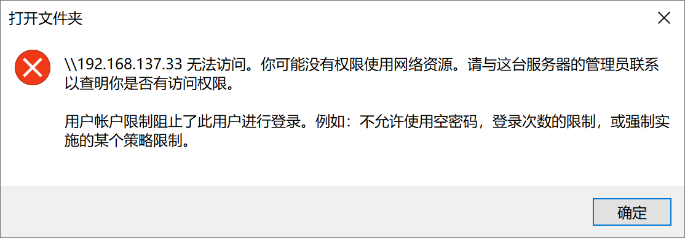
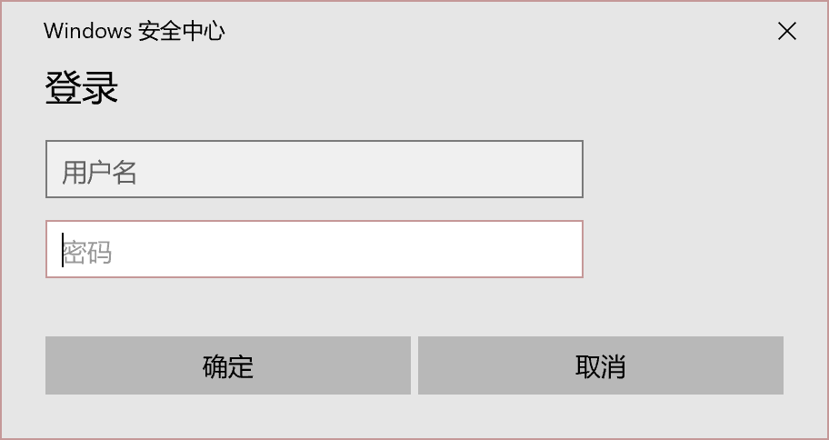

&emsp;&emsp;本文档记录Windows操作和设置相关的选项。

# 文件占用

&emsp;&emsp;后台占用导致文件无法修改、删除等操作。解决办法是：打开任务管理器-左下角详细信息-上方工具栏性能-打开资源监视器-cpu-搜索句柄-输入被占用文件的名字，就可以观察到被哪些占用了，结束进程即可，点击刷新。

# 苹果手机USB无法直接手机WiFi

&emsp;&emsp;原因：没有驱动。解决办法：打开爱思助手-工具箱-ITunes及驱动-修复驱动，然后卸载系统存储的旧驱动文件，解决了。

&emsp;&emsp;有时候还可能会显示网线已经拔出等连接不上的情况，重启手机可以解决。

# 以太网

## 通过有线共享网络
&emsp;&emsp;我有两台笔记本A和B，其中A的无线网卡坏了。现在想用B的无线网卡上网，用有线将A和B连接起来。可以实现吗？

&emsp;&emsp;答：可以实现

1.首先B笔记本使用无线连接上网络
2.需要一根网线，将笔记本A和笔记本B连接起来，不过最好是568A线 ，也可以使用家里正常使用的网线
3.右键点击B笔记本的无线网卡，选择属性，出现无线网卡连接属性界面，点击上面的共享，
4. 在家庭网络连接中选择本地连接（有线网），点击确定。等会，你的本地连接就会被分配一个IP地址。
我的电脑被分配的是：192.168.137.1。
5.在A笔记本上，找到本地连接，然后右键属性，选择IPV4协议，手动配置IP地址：
IP地址：192.168.137.3
子网掩码：255.255.255.0 
默认网关：192.168.137.1
首选DNS：192.168.137.1
点击保存，以后A就可以上网了

以上来源于[百度知道](http://zhidao.baidu.com/question/1667953723070067227/answer/1571288267)。

## 两台电脑通过网线连接

&emsp;&emsp;电脑设置IPV4，分别设置为192.168.137.1和192.168.137.33。运行：\\192.168.137.33。报错：

{#fig:没有权限使用网络资源}

该问题待解决。

# 无线网

## 部分WiFi信号缺失

&emsp;&emsp;部分WiFi信号搜索不到。解决办法：设备管理器-网络适配器-更新无线网卡驱动，就算已经是最新的驱动，wifi正常了。

# 磁盘

## 固态硬盘和机械硬盘

&emsp;&emsp;总结：NVME固态硬盘无法通过转接口接到SATA硬盘，，2018年左右的电脑PCIE是3.0的。有专门的SATA硬盘；机械硬盘一般都是SATA口，SATA一般是3.0的。顺序读写速度是存储速度，随机读写速度是加载速度，PCIE越高顺序读取速度越快，理论速度还和通道数有关，一般传输文件只开启一两个通道，所以不可能慢速的；随机读写速度差不多，无论NVME还是SATA，因为随机读写器的性能提升不大，所以开机速度差不多；机械硬盘的顺序读写速度要差些，随机读写速度更慢了。顺序读写速度理论最大值：PCIE4.0速度为$7000MB/S$左右，PCIE4.0速度为$3500MB/S$左右，SATA3.0（$6Gb/S$）固态硬盘速度为$560MB/S$左右，SATA3.0机械硬盘（转速5400$r/min$常见）速度为$200MB/S$左右；顺序读写速度的体现是大文件的拷贝：PCIE达到$GB/S$级别，SATA3.0固态硬盘速度为$200MB/S$左右，SATA3.0机械硬盘速度为$100MB/S$左右，SATA3.0机械硬盘速度为$50MB/S$左右。值得观看的视频[【你真的需要高速PCIe4.0的固态嘛？机械硬盘 sata固态PCIe3.0 PCIe4.0固态除了跑分，实际使用场景上究竟有什么区别？实测给你答案！】](https://www.bilibili.com/video/BV13L41187NE/?share_source=copy_web&vd_source=6b55cb6788b1952e04c06b095d772810)

# 移动硬盘

&emsp;&emsp;固态硬盘可以通过硬盘盒转为移动硬盘，优点：可拓展性强，缺点：密封性差，对硬盘保护差。三星T7硬盘（型号：MU-PC1T0）内部不是SATA或者NVME的是定制的，板载颗粒连接TYPE-C。

# 防火墙

## Windows安全中心

### 账户密码弹窗

&emsp;&emsp;弹窗如下[@fig:Windows安全中心账户密码弹窗]所示：

{#fig:Windows安全中心账户密码弹窗}

解决办法：设置-网络和Internet-以太网-相关设置-更改适配器选项-以太网-属性-身份验证-启用IEEE 802.1身份验证，取消勾选。